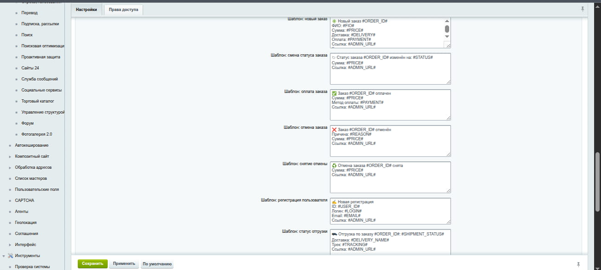

# ushakov.telegram - модуль интеграции Bitrix с Telegram

Лёгкий и надёжный модуль для отправки уведомлений из 1C‑Bitrix в Telegram: новые заказы, оплаты, смены статусов, отмены/снятие отмены, статусы отгрузок и регистрация пользователей. Поддерживает уведомления как для сотрудников, так и для покупателей.

## Возможности
- Раздельные события и шаблоны для сотрудников и покупателей
- HTML‑сообщения с безопасным экранированием переменных
- Кнопка «Привязать Telegram» в личном кабинете, дип‑ссылки `/start`
- Безопасный вебхук: секрет + HMAC подпись payload
- Управление правами доступа в настройках модуля
- Установка из `/local/modules` и `/bitrix/modules`

## Скриншоты
### Настройки модуля

### Кнопка «Привязать Telegram»

## Установка
Кратко:
1. Скопируйте модуль в каталог `local/modules/ushakov.telegram` (или `bitrix/modules/ushakov.telegram`).
2. В админке перейдите: Настройки → Настройки продукта → Модули → установить модуль «ushakov.telegram» (или Marketplace → Установленные решения → Telegram уведомления (ushakov.telegram) установить).
3. Откройте настройки модуля, укажите токен бота и установите вебхук.

Подробная инструкция - в файле [docs/INSTALL.md](./docs/INSTALL.md).
Как создать бота (5 минут) - [docs/BOT.md](./docs/BOT.md).

## Настройка и использование
- Заполните `BOT_TOKEN` и `BOT_USERNAME` (бот от @BotFather)
- Установите вебхук (кнопка «Установить вебхук»)
- Включите нужные события для сотрудников и покупателей
- Отредактируйте текстовые шаблоны сообщений при необходимости
- Включите показ кнопки «Привязать Telegram» для покупателей (опционально)

Подробнее - в [docs/CONFIG.md](./docs/CONFIG.md).

## FAQ
- Сообщения не приходят на проде, а в локали всё работает
  - Проверьте исходящий HTTPS к `api.telegram.org` (cURL/CA). Вебхук - входящий, а отправка - исходящая.
- Часть шаблонов не сохраняется
  - Если БД в `utf8mb3`, избегайте «четырёхбайтных» эмодзи. Рекомендуем `utf8mb4`.
- Вебхук установлен, но бот молчит
  - Убедитесь, что в модуле задан корректный `BOT_TOKEN`, а сервер может выполнить HTTPS‑запрос к Telegram API.

## Roadmap
- Очередь сообщений и ретраи с учётом лимитов Telegram (пики активности)

## Обновления
Список релизов и изменений - в [docs/CHANGELOG.md](./docs/CHANGELOG.md).

## Лицензия
Проект распространяется по лицензии MIT - см. файл [LICENSE](./LICENSE).

## Контакты
Автор: Dmitry Ushakov (UshakovDev) 
GitHub: https://github.com/UshakovDev 
Telegram: https://t.me/user_four